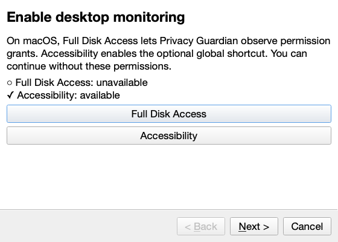

# Privacy Guardian

Privacy Guardian is a local-first background app for macOS and Windows that helps people make privacy decisions at the moment a site or application asks for data or access. It examines supported browser and desktop signals, applies a shared decision engine, and stays quiet when the event does not need attention.

The app can classify sensitive categories in documents and forms, inspect consent and tracking signals, and relate a request to the apparent purpose of a site or application. It presents one of three outcomes: **Ignore**, **Inform**, or **Intervene**, with an explanation and an action where one is available.

This repository is an in-progress initial build. Core, analysis, UI/platform, IPC, and one real Chromium native-host/browser path have independent evidence recorded in `docs/PLAN.md`; the full acceptance suite, real Windows execution, fresh-clone verification, and final release rebuild are still pending. Treat the installation and packaging sections below as build instructions, not a claim that release artifacts exist today.

## Feature matrix

| Capability | Browser extension | macOS desktop | Windows desktop | Offline | Optional LLM-assisted |
|---|---:|---:|---:|---:|---:|
| Document category detection and redaction | Native-host path wired; one Chromium flow verified | — | — | Yes | No |
| Form field semantics | Native-host path wired; three badges verified on fixture | — | — | Yes | No |
| Policy and terms clause extraction | Wired; broader browser E2E pending | — | — | Yes | Policy refinement only |
| Consent-banner analysis | Wired; broader browser E2E pending | — | — | Yes | No |
| Tracker and fingerprinting signal analysis | Wired; blocking behavior E2E pending | — | — | Yes | No |
| Permission, startup, and broad-access observation | — | Adapter and UI tests pass; live grant/revocation pending | Adapter test passes; physical/CI verification pending | Yes | No |
| Clipboard and screen-access signals | — | Foreground-change proxy; see limitations | Foreground-change proxy; see limitations | Yes | No |
| Decision engine, preferences, and local history | Service API wired | Service/UI wired | Service/UI wired; platform verification pending | Yes | Explanation polish only |
| Deep Check | Context supplied by extension | UI rendered; integration flow pending | UI rendered; Windows validation pending | Yes | Narrative only |

The verified Chromium fixture result is a native-host handshake and three `free-download` form badges. It does not establish all browser actions or scenarios. A dash means that the capability is outside that surface.

## Screenshots

These Cocoa-rendered UI snapshots are checked into `docs/img/` and are readable visual evidence of the rendered views. They are not evidence of a live macOS permission grant or an end-to-end browser decision.

| Intervention | Dashboard |
|---|---|
|  |  |

| Onboarding | Deep Check |
|---|---|
|  |  |

System Settings is intentionally not screenshot: its application lists expose user-installed app names. The onboarding screen provides the permission guidance instead.

## Requirements

Supported targets are macOS 13 or later (Apple Silicon or Intel) and Windows 10 21H2 or later / Windows 11 x64. This build has been developed on macOS 27 arm64; real Windows execution remains pending CI.

Source work requires Python 3.12 (the project constrains Python to `>=3.12,<3.13`), [uv](https://docs.astral.sh/uv/), and Tesseract for OCR. Browser integration targets Chrome, Edge, Brave, and Firefox through Manifest V3-style native messaging; installation and an end-to-end browser handshake are pending verification.

On macOS, Homebrew, Xcode Command Line Tools, and `create-dmg` are needed for the packaging path. A macOS packaging build additionally compiles a macOS-13-compatible static Tesseract bundle, which needs CMake, a compiler, Autotools, libtool, pkg-config, and network access for its source downloads. On Windows, use winget for prerequisites and install Inno Setup before attempting an installer build. The repository does not currently contain published installers.

## Install from release

There are no verified release artifacts for version 0.1.0 yet. Once a signed macOS `.dmg` or Windows setup executable has been built and uploaded, the intended steps are:

1. Download the artifact from the project’s GitHub Releases page and verify its release notes/checksum when supplied.
2. On macOS, open the `.dmg`, move `PrivacyGuardian.app` to Applications, then open it. An ad-hoc-signed build may require Control-click → **Open** at first launch.
3. On Windows, run `PrivacyGuardian-Setup-<version>.exe` and accept the installer’s visible autostart option.
4. Install the matching browser extension once its signed/published package is available. Development loading is described below.

macOS monitoring may require Full Disk Access and Accessibility permission. Use the in-app settings action to open the relevant pane; instructions with verified screenshots are pending. These permissions are not a guarantee that every OS signal can be observed; see [Platform limitations](#platform-limitations).

## Build from source

These are the repository’s declared commands. They have **not** yet been verified by a fresh-clone worker. A first macOS app/DMG build passed codesign, packaged smoke, and UDZO image checks, but it is stale and must be rebuilt after current changes; Windows packaging remains pending.

macOS:

```sh
xcode-select --install
brew install uv tesseract create-dmg cmake autoconf automake libtool pkg-config
uv sync
make setup
make run
make build-extension
make build-mac
```

Windows (PowerShell):

```powershell
winget install --id AstralSoftware.UV -e
winget install --id UB-Mannheim.TesseractOCR -e
winget install --id JRSoftware.InnoSetup -e
uv sync
make setup
make run
make build-extension
make build-win
```

`make build-extension` writes `dist/privacy-guardian-chromium.zip` and `dist/privacy-guardian-firefox.zip`. `make build-mac` builds `dist/PrivacyGuardian.app` and `dist/PrivacyGuardian-<version>.dmg`; it signs ad hoc by default, or uses `CODESIGN_IDENTITY` and optional `NOTARY_PROFILE`. `make build-win` invokes PyInstaller and Inno Setup on Windows. A final rebuild and installer smoke checks remain required before distributing any artifact. For non-English OCR, install the appropriate Tesseract language data in the host operating system; English and OSD data are the currently bundled packaging target.

## Run in development

Start the desktop process with:

```sh
make run
```

The console entry point is `privacy-guardian`; the native host entry point is `privacy-guardian-host`. Diagnose a profile without starting the UI with:

```sh
uv run privacy-guardian --diagnose
```

The report contains platform/Python information, OCR availability, native-host registrations, detected browsers, local database counts, token presence, and permission status. `--smoke-test` starts an isolated UI smoke path, and `--no-autostart` suppresses autostart for that invocation.

For a development registration, start the desktop service then run:

```sh
uv run privacy-guardian --install-native-host
```

Load the matching unpacked extension source in the browser’s developer-extension view. Chromium-family browsers use ID `bfdjphkbgihhbonhnmjbbfhckdddonob`; Firefox uses `privacy-guardian@privacyguardian.local`. The installer writes native-host manifests for Chrome, Edge, Brave, and Firefox. Chromium native-host handshake plus a three-badge fixture path were verified; reconnection and the remaining browser scenarios remain pending.

Runtime data defaults to `~/Library/Application Support/PrivacyGuardian` on macOS, `%APPDATA%\\PrivacyGuardian` on Windows, and `$XDG_DATA_HOME/PrivacyGuardian` on other systems. Logs are configured below that data directory.

## Testing

Run the declared checks with:

```sh
make test
make e2e
make lint
make typecheck
make check
```

Independent evidence includes 115 analysis/engine/LLM/util tests passing; 66 new integration/platform tests passing with one Windows skip; 39 UI tests passing with two platform skips; one real FSEvents test passing; and a Chromium native-host handshake plus three form badges on the free-download fixture. Ruff and strict mypy were clean for 70 macOS source modules; Bandit medium-and-above was clean. These are partial results, not a full `make check` claim.

The current combined coverage report was 48% overall and 70.9% for the scoped core/detector/engine/storage set before later UI/platform additions, below the final 70% overall/85% scoped gates. Use `-m macos`, `-m windows`, `-m e2e`, `-m perf`, and `-m llm` only in an environment that supports those markers. Current outstanding checks include full coverage, remaining 18 browser scenarios, real Windows CI, final macOS rebuild/install/uninstall smoke, and fresh-clone verification. CI run [35443041292](https://github.com/tashvianeja/Privacy-Guardian/actions/runs/35443041292) has failures under repair and is not green evidence.

## Configuration

Settings are loaded from `settings.toml` in the data directory, then overridden by environment variables beginning with `PRIVACY_GUARDIAN_`. Nested keys use a double underscore. Values are parsed as JSON when possible, so booleans must be `true`/`false`, lists must be JSON arrays, and paths should be JSON strings.

| TOML key | Environment variable | Default | Meaning |
|---|---|---|---|
| `data_dir` | `PRIVACY_GUARDIAN_DATA_DIR` | OS-specific data directory | Local data, settings, token, logs, and SQLite location. |
| `retention_days` | `PRIVACY_GUARDIAN_RETENTION_DAYS` | `90` | Retention period, 1–3650 days. |
| `analysis_timeout_seconds` | `PRIVACY_GUARDIAN_ANALYSIS_TIMEOUT_SECONDS` | `20` | Per-analysis deadline, 1–120 seconds. |
| `popup_timeout_seconds` | `PRIVACY_GUARDIAN_POPUP_TIMEOUT_SECONDS` | `60` | Popup wait/timeout, 1–60 seconds. |
| `autostart` | `PRIVACY_GUARDIAN_AUTOSTART` | `true` | Whether the app should configure startup behavior. |
| `onboarding_complete` | `PRIVACY_GUARDIAN_ONBOARDING_COMPLETE` | `false` | Whether onboarding has been completed. |
| `hotkey` | `PRIVACY_GUARDIAN_HOTKEY` | `"Ctrl+Shift+P"` | Configured hotkey text. |
| `log_level` | `PRIVACY_GUARDIAN_LOG_LEVEL` | `"INFO"` | Application logging level. |
| `reject_optional_cookies` | `PRIVACY_GUARDIAN_REJECT_OPTIONAL_COOKIES` | `true` | Preference for optional-cookie handling. |
| `allowed_extension_ids` | `PRIVACY_GUARDIAN_ALLOWED_EXTENSION_IDS` | `["privacy-guardian@privacyguardian.local", "bfdjphkbgihhbonhnmjbbfhckdddonob"]` | Native-host caller allowlist. |
| `clipboard_allowlist` | `PRIVACY_GUARDIAN_CLIPBOARD_ALLOWLIST` | `[]` | Requester keys permitted to read clipboard without an intervention. |
| `llm.enabled` | `PRIVACY_GUARDIAN_LLM__ENABLED` | `false` | Enables optional cloud assistance. |
| `llm.model` | `PRIVACY_GUARDIAN_LLM__MODEL` | `"gpt-6-astra"` | Model identifier currently supplied by the code and checked against current OpenAI model documentation; no live API call was made. |
| `llm.policy_refinement` | `PRIVACY_GUARDIAN_LLM__POLICY_REFINEMENT` | `true` | Allows optional public-policy refinement. |
| `llm.purpose_refinement` | `PRIVACY_GUARDIAN_LLM__PURPOSE_REFINEMENT` | `true` | Allows optional purpose refinement. |
| `llm.explanation_polishing` | `PRIVACY_GUARDIAN_LLM__EXPLANATION_POLISHING` | `true` | Allows optional category-level explanation polish. |
| `llm.deep_check_narrative` | `PRIVACY_GUARDIAN_LLM__DEEP_CHECK_NARRATIVE` | `true` | Allows optional Deep Check narrative generation. |

Example:

```toml
retention_days = 30
reject_optional_cookies = true

[llm]
enabled = false
model = "gpt-6-astra"
policy_refinement = true
purpose_refinement = true
explanation_polishing = true
deep_check_narrative = true
```

Do not place API keys in `settings.toml` or environment variables. When LLM assistance is enabled, the UI/client stores the key in the operating-system keychain under service `PrivacyGuardian`, account `openai_api_key`; unsupported keyring backends are rejected.

## Architecture overview

The service routes typed `PrivacyEvent` objects from platform or browser sensors through local analysis and the decision engine, then records redacted projections in SQLite and emits UI decisions. Native messaging uses length-prefixed JSON and an authenticated local channel. Read [Architecture](docs/ARCHITECTURE.md), [the decision engine](docs/DECISION_ENGINE.md), and [detector scope](docs/DETECTORS.md) for the implemented contracts.

## Privacy statement

The implemented analysis worker returns opaque payload handles plus category findings. Raw file/form values remain in worker memory, while the transport may carry bytes only for the active upload and discards them after use. The storage contract excludes raw payload references, field labels/names, file names, URL query strings, and raw extracted text.

Privacy Guardian has no telemetry in its declared design. Network use is limited to optional OpenAI API calls when enabled, a policy/terms fetch requested by a page context when inline text is unavailable, and a GitHub Releases API request only after the user selects **Check for updates**. Cloud assistance is disabled by default, sanitizes every outbound string, replaces detected values with category tokens, and rejects validated identifiers that survive sanitization. See [LLM usage](docs/LLM_USAGE.md) and [Threat model](docs/THREAT_MODEL.md).

## Platform limitations

Read [Platform limitations](docs/PLATFORM_LIMITATIONS.md) before relying on a signal for security or compliance decisions. Real TCC grant/screen-capture verification, real Windows execution, most browser scenarios, final installer smoke tests, and CI are pending. The tool gives privacy guidance; it cannot guarantee interception of every application, browser, permission change, or network transfer.

## Troubleshooting

If OCR is unavailable, run `tesseract --version`, install Tesseract with the platform command above, and restart the app. For a packaged macOS app, rebuild if the bundled OCR binary is absent. If native messaging cannot find the host, run `uv run privacy-guardian --install-native-host`, confirm the browser-specific host registration and allowed extension ID, then inspect the data-directory logs.

If macOS events are missing, grant the requested Full Disk Access or Accessibility permission through System Settings, then restart the monitor. If an extension disconnects, restart the browser and the app; reconnect behavior is a pending resilience test. If `uv sync` fails on the spaCy model dependency, ensure GitHub access is available because the current package declaration uses the model wheel’s direct GitHub URL.

## Uninstall

The native-host deregistration/uninstall path is implemented but final packaged-app smoke verification is pending. The declared macOS target is:

```sh
make uninstall-mac
```

For development profiles, the equivalent command is `uv run privacy-guardian --uninstall`. Both paths remove known Privacy Guardian files, browser-host registrations, and autostart entries while avoiding recursive deletion of an arbitrary configured data directory. Do not manually delete a data directory if you need its local preferences or event history. Once verified installers are available, use the operating-system uninstaller first.

### License

MIT. See [LICENSE](LICENSE).
