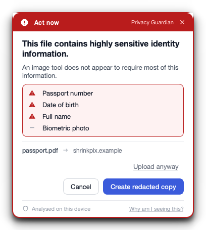
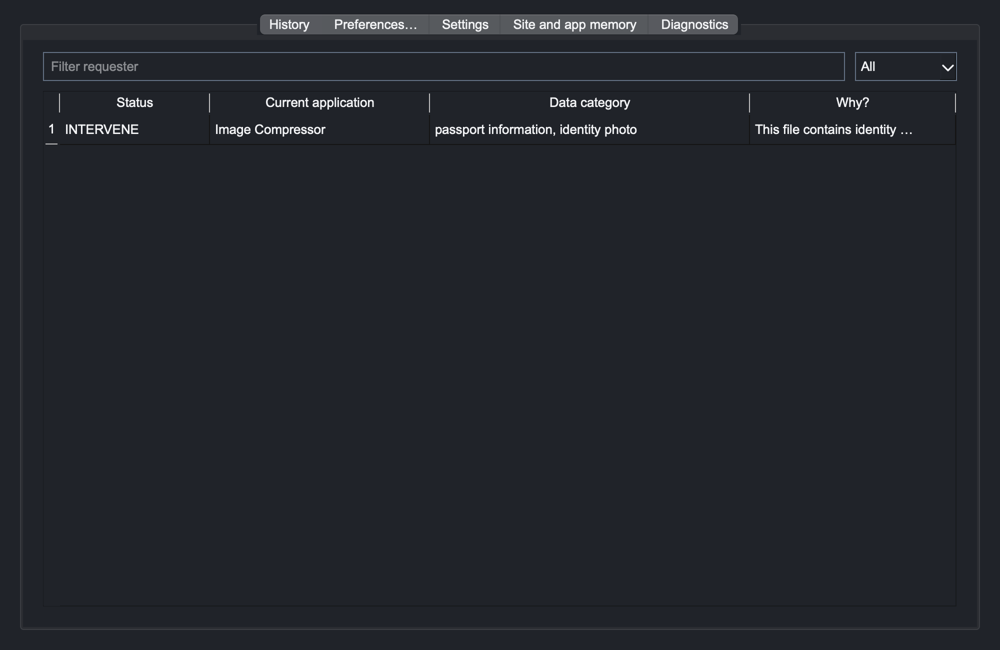
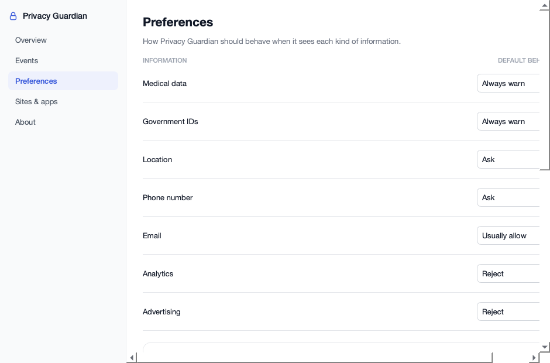
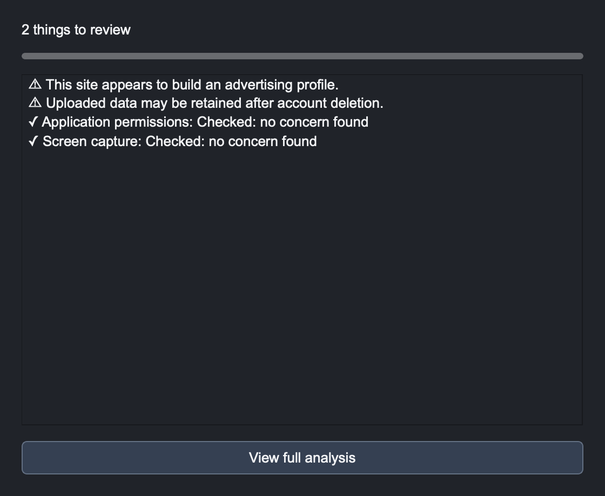
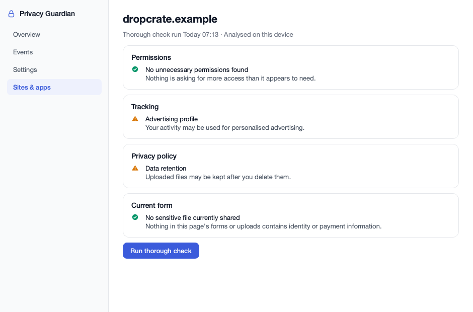

# Privacy Guardian

**A small app that lives in your menu bar and speaks up right before you make a privacy decision.**

You make dozens of them a day. You drag a file into a free website. You tick a box. You hit Accept
because the reject button is two screens deep. Nobody tells you what is being taken, who is taking
it, or whether they need it at all.

Privacy Guardian watches for those moments, works out what is actually being asked for, and asks
one question on your behalf:

> **Does this site or app actually need this, for what you are doing?**

It stays quiet the rest of the time. Everything is analysed on your own machine.

---

## What it looks like

When a scanned passport goes into a free image compressor:



*The safe option is the big one. "Upload anyway" is still there, in plain text, because it is your
file and your decision.*

| Event history | Preferences |
|---|---|
|  |  |

| Thorough check | Full report |
|---|---|
|  |  |

Screenshots are rendered from the real Qt widgets by
[`tests/unit/ui/render_screenshots.py`](tests/unit/ui/render_screenshots.py), so they cannot drift
from the code. System Settings is deliberately never captured: its lists expose the names of apps
you have installed.

---

## Install on macOS

Requires macOS 13 (Ventura) or newer, on Apple Silicon or Intel.

```sh
git clone https://github.com/tashvianeja/Privacy-Guardian.git
cd Privacy-Guardian
./install.sh
```

The script checks your prerequisites, installs [uv](https://docs.astral.sh/uv/) if it is missing,
builds `PrivacyGuardian.app`, copies it to `/Applications`, registers the browser bridge for
Chrome, Edge, Brave and Firefox, starts the app, and leaves its setup walkthrough on screen.

| Flag | What it does |
|---|---|
| `--skip-ocr` | Skips compiling the bundled OCR engine. Much faster. Scanned images are then reported as *unchecked* rather than silently skipped. |
| `--no-autostart` | Does not start Privacy Guardian when you log in. |
| `--uninstall` | Removes the app, the browser bridge, autostart and the local database. |

The first build with OCR compiles a static Tesseract from source and takes several minutes. Use
`--skip-ocr` if you only care about forms, cookies, policies, tracking and desktop permissions.

### Then finish setup

Privacy Guardian opens its setup walkthrough the first time it starts, and the script leaves it
on screen for you.

Most of what Privacy Guardian sees comes through the browser, so the extension is not optional and
setup will not move past it until a browser has actually connected. That page registers the native
messaging bridge, shows you where the extension lives with a copy button, and updates itself the
moment a browser appears:

- **Chrome, Edge, Brave** — extensions page → Developer mode → *Load unpacked* → select `extension/`
- **Firefox** — `about:debugging#/runtime/this-firefox` → *Load Temporary Add-on* → select
  `extension/manifest.firefox.json`

You can continue without it, but that takes a confirmation and leaves setup marked incomplete, so
it will ask again next time. Packaged zips are written to `dist/` by the same build.

Desktop monitoring is genuinely optional, and setup says so. Reopen the walkthrough any time from
the menu bar under **Set up Privacy Guardian**.

### Optional: desktop monitoring

System Settings → Privacy & Security:

- **Full Disk Access** lets Privacy Guardian see the permissions other apps have been granted
- **Accessibility** enables the ⌘⇧P thorough-check shortcut

Everything in the browser works without either. The setup walkthrough shows their live status and
links straight to the right pane.

---

## What it watches

| | What it notices | Where |
|---|---|---|
| **File uploads** | Government IDs, financial and medical details, contact details, faces, location metadata — then asks whether the destination needs them. Offers a redacted copy. | Browser |
| **Form fields** | Which fields a form asks for that its stated purpose does not need. | Browser |
| **Terms & conditions** | The clauses that actually change what happens to your data, and points at them on the page. | Browser |
| **Privacy policies** | What is collected, who it is shared with, how long it is kept. | Browser |
| **Cookie banners** | What each choice really means, including banners designed to wear you down. Can reject the optional ones for you. | Browser |
| **Advertising profiles** | Cross-site identifiers, fingerprinting, persistent cookies — described as profiling, not as mechanisms. | Browser |
| **App permissions** | A permission compared against what the app appears to do. | macOS |
| **Broad system access** | Full disk access, startup, background execution, screen recording, accessibility. | macOS |
| **Clipboard** | An app reading your clipboard while it holds something sensitive. | macOS |

Every one of these goes through the same engine: **what is being taken → who is taking it → why do
they need it → is it necessary here → what happens to it → what do you normally allow**. The answer
is one of three things.

**Ignore.** Nothing appears. This is what happens almost all the time.

**Inform.** A toast, bottom right. No buttons beyond its close control. *"Identity document shared
with Government of Verdania eVisa Portal — expected for an identity check."*

**Intervene.** The widget, with the safe option as the easy one, and the way past it still there.

Neither one times out. It stays until you deal with it, and a second one stacks above the first
rather than landing on top of it, so nothing ever covers the buttons you are reaching for.

### Thorough check

Click the menu bar padlock → **Run thorough check**, or press ⌘⇧P. It looks at the current site and
app together — permissions, tracking, the privacy policy, the form in front of you — and gives one
consolidated answer. Useful when something feels off but nothing has been flagged.

### Learning

Privacy Guardian notices when you keep making the same protective choice. After you have rejected
optional cookies on five different sites it asks, once:

> **Make "reject optional cookies" your default?**
> *Keep asking me* · **Yes, do it automatically**

It never decides for you, and it never offers to automate anything involving government IDs,
medical, financial or credential data. That boundary is in the code
([`engine/preferences.py`](src/privacy_guardian/engine/preferences.py)), not just in the copy.

---

## Everything stays here

- Documents, clipboard contents and form values are analysed in a local worker process. Raw bytes
  live only for the length of that analysis.
- The extension sends field *metadata*, never field values.
- Local history stores category names, not content: no field labels, no URL query strings, no
  extracted text. It is deleted after your retention period.
- There is no telemetry, no account and no server.

Network access is limited to four things, all of which you trigger: an optional Gemini call when
you enable cloud assistance, fetching a policy page the site itself links to, the tracker-list
refresh button, and the update check. Cloud assistance is off by default; when on, it sends
category tokens rather than values and drops anything that still looks like an identifier. See
[LLM usage](docs/LLM_USAGE.md) and the [threat model](docs/THREAT_MODEL.md).

---

## Develop

```sh
uv sync                 # dependencies
make run                # start the desktop app
make check              # lint, strict mypy, tests
make build-extension    # dist/privacy-guardian-{chromium,firefox}.zip
make build-mac          # dist/PrivacyGuardian.app and the .dmg
```

`make setup` additionally provisions Firefox, Node and web-ext for the browser end-to-end suite.
`uv run privacy-guardian --diagnose` prints platform, OCR availability, host registrations,
detected browsers, database counts and permission status without starting the UI.

Current state on macOS 26 arm64: **274 passed, 4 skipped** across `tests/unit`,
`tests/integration` and `tests/platform`; Ruff and strict mypy clean across 76 modules. The
browser end-to-end suite (`make e2e`) and the performance suite need a headed browser and are run
separately. Windows support is in the codebase but has not been validated on a physical machine,
and `install.sh` is macOS only.

### How it fits together

```
  Browser extension                    macOS adapter
  uploads · forms · cookies            permissions · system access
  policies · terms · tracking          clipboard · screen · startup
          │                                    │
          └──────────────┬─────────────────────┘
                         ↓
              Background service  ──  local analysis workers
                         ↓
       Decision engine: necessity × sensitivity × consequence × your preferences
                         ↓
          Ignore   ·   Inform   ·   Intervene      →   SQLite, on this device
```

The in-page widget and the desktop widget are the same design and read from the same structured
`Decision`: a headline, a short body, severity-marked finding rows, a context line, and actions
ranked so the protective one is the easiest to hit. Read
[Architecture](docs/ARCHITECTURE.md), [the decision engine](docs/DECISION_ENGINE.md) and
[detector scope](docs/DETECTORS.md) for the contracts.

---

## Configuration

`settings.toml` in the data directory
(`~/Library/Application Support/PrivacyGuardian` on macOS), overridden by environment variables
prefixed `PRIVACY_GUARDIAN_`. Nested keys use a double underscore. Values are parsed as JSON, so
booleans are `true`/`false` and lists are JSON arrays.

| Key | Environment variable | Default | Meaning |
|---|---|---|---|
| `data_dir` | `PRIVACY_GUARDIAN_DATA_DIR` | OS data directory | Settings, token, logs and SQLite location. |
| `retention_days` | `..._RETENTION_DAYS` | `90` | How long event history is kept, 1–3650. |
| `analysis_timeout_seconds` | `..._ANALYSIS_TIMEOUT_SECONDS` | `20` | Per-analysis deadline, 1–120. |
| `popup_timeout_seconds` | `..._POPUP_TIMEOUT_SECONDS` | `60` | How long a widget waits before taking its safe default, 1–60. |
| `autostart` | `..._AUTOSTART` | `true` | Start when you log in. |
| `learning_enabled` | `..._LEARNING_ENABLED` | `true` | Offer to turn repeated choices into defaults. |
| `hotkey` | `..._HOTKEY` | `"Ctrl+Shift+P"` | Thorough-check shortcut. `Ctrl` maps to ⌘ on macOS. |
| `log_level` | `..._LOG_LEVEL` | `"INFO"` | Logging level. |
| `reject_optional_cookies` | `..._REJECT_OPTIONAL_COOKIES` | `true` | Make "reject optional" the recommended cookie action. |
| `clipboard_allowlist` | `..._CLIPBOARD_ALLOWLIST` | `[]` | Apps allowed to read the clipboard without a warning. |
| `allowed_extension_ids` | `..._ALLOWED_EXTENSION_IDS` | the two shipped IDs | Native-host caller allowlist. |
| `llm.enabled` | `..._LLM__ENABLED` | `false` | Optional cloud assistance. |
| `llm.model` | `..._LLM__MODEL` | `"gpt-6-astra"` | Model identifier. |
| `llm.policy_refinement` | `..._LLM__POLICY_REFINEMENT` | `true` | Refine public policy and terms clauses. |
| `llm.purpose_refinement` | `..._LLM__PURPOSE_REFINEMENT` | `true` | Refine what a site or app appears to be for. |
| `llm.explanation_polishing` | `..._LLM__EXPLANATION_POLISHING` | `true` | Improve category-only wording. |
| `llm.deep_check_narrative` | `..._LLM__DEEP_CHECK_NARRATIVE` | `true` | Improve thorough-check summaries. |

API keys never go in `settings.toml` or the environment. The app stores them in the system keychain
under service `PrivacyGuardian`, account `gemini_api_key`.

---

## Limits worth knowing

Privacy Guardian gives guidance. It cannot intercept every application, permission change or
network transfer, and it is not a compliance tool.

On macOS it **observes** permission grants; it cannot revoke them. When a permission looks
unnecessary the widget takes you to the exact pane in System Settings where you can turn it off
yourself. Clipboard and screen access are detected through a foreground-change proxy rather than a
kernel hook, so an app reading the clipboard entirely in the background may be missed. Built
without OCR, scanned pages are reported as unchecked — never silently treated as clean.

Full detail in [Platform limitations](docs/PLATFORM_LIMITATIONS.md).

---

## Troubleshooting

**The browser extension cannot reach the app.** Run
`/Applications/PrivacyGuardian.app/Contents/MacOS/PrivacyGuardian --install-native-host`, restart
the browser, and check `--diagnose` for `native_host_registrations`.

**macOS says the app is damaged or from an unidentified developer.** A locally built app is signed
ad hoc, not notarised. `install.sh` clears the quarantine flag; if you moved the app by hand, run
`xattr -dr com.apple.quarantine /Applications/PrivacyGuardian.app`.

**Desktop events are missing.** Grant Full Disk Access, then quit and reopen the app — TCC changes
are only picked up on restart.

**`uv sync` fails on the spaCy model.** The model is declared as a direct GitHub URL, so that
dependency needs GitHub reachable.

**OCR is unavailable.** Check `--diagnose` for `ocr_available`. Rebuild without `--skip-ocr`, or
`brew install tesseract` for a source checkout.

---

## Uninstall

```sh
./install.sh --uninstall
```

Or, from a source checkout, `make uninstall-mac`. Both remove the app's own files, the browser host
registrations and the autostart entry, and neither recursively deletes a data directory you
configured yourself. Remove the extension from your browser's extensions page.

---

## License

MIT. See [LICENSE](LICENSE).
